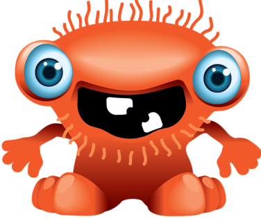

# lesson4.5_shooting_game

# Игра на выживание 

Игра с постоянным передвижением, где на поле постоянно появляются монстры, 
которых нельзя касаться

# Правила игры

- В начале игры у игрока 5 жизней. 
- При каждом столкновении с монстром одна жизнь пропадает.
- Ведется счет убитых монстров, всего нужно убить 10 монстров.

Игра заканчивается в одном из следующих случаев:
* если убито 10 монстров (победа игрока)
* если потеряно 5 жизней (проигрыш игрока)

## Игрок

### Начальное положение игрока

В начале игры игрок находится в центре окна

### Перемещение игрока

Игрока можно перемещать по полю используя стрелки

### Выстрелы игрока

Игрок может убить монстра, кликая по нему левой кнопкой мышки

## Монстр

Монстр появляется в случайной точке на границе окна 
и движется все время по направлению к игроку.

В каждый момент времени в окне находится только один монстр.

